# Dependency Atlas — maschinell abgeleitet

**Nicht von Hand pflegen.** Erzeugt durch
`python -m fusion_hero_os.core.dependency_atlas --write`;
Vollgraph in `dependency_atlas.json`. CI-Gate: `--check`
(fatal bei unaufgeloesten gerooteten Imports und neuen Import-Zyklen).

- Knoten: **380** (Python-Module, Rust-Crates, JS-Paket)
- Kanten: **579** (davon deferred: 318)
- Unaufgeloeste gerootete Imports: **0**
- Import-Zyklen (top-level): **0**
- Platzhalter-Marker: **74** in 28 Dateien

## Layer-Graph (Paketebene)

```mermaid
graph TD
  subgraph L_ascension["Layer: ascension"]
    ascension_os___init___py["ascension_os/__init__.py"]
    ascension_os_core["ascension_os/core"]
    ascension_os_evolution["ascension_os/evolution"]
  end
  subgraph L_intelligence["Layer: intelligence"]
    fusion_hero_os_providers["fusion_hero_os/providers"]
  end
  subgraph L_kernel["Layer: kernel"]
    kernel___init___py["kernel/__init__.py"]
    kernel_bridge["kernel/bridge"]
  end
  subgraph L_knowledge["Layer: knowledge"]
    core_heroic_core_orchestrator_py["core/heroic_core_orchestrator.py"]
    core_heroic_math_engine_py["core/heroic_math_engine.py"]
    fusion_hero_os_core["fusion_hero_os/core"]
    pms_rust_kernel_crate_Cargo_toml["pms_rust_kernel_crate/Cargo.toml"]
  end
  subgraph L_mainframe["Layer: mainframe"]
    fusion_hero_os___init___py["fusion_hero_os/__init__.py"]
    fusion_hero_os_bridge["fusion_hero_os/bridge"]
    fusion_hero_os_config_py["fusion_hero_os/config.py"]
    fusion_hero_os_engine["fusion_hero_os/engine"]
    fusion_hero_os_integrations["fusion_hero_os/integrations"]
    fusion_hero_os_mcp["fusion_hero_os/mcp"]
    fusion_hero_os_methodology["fusion_hero_os/methodology"]
    fusion_hero_os_modules["fusion_hero_os/modules"]
    fusion_hero_os_orchestration["fusion_hero_os/orchestration"]
    fusion_hero_os_registry_py["fusion_hero_os/registry.py"]
    rust_engine_crate_Cargo_toml["rust_engine_crate/Cargo.toml"]
  end
  subgraph L_orchestration["Layer: orchestration"]
    03_Code_llm_frameworks["03_Code/llm_frameworks"]
  end
  subgraph L_proof["Layer: proof"]
    tests_conftest_py["tests/conftest.py"]
    tests_test_automation_scheduler_py["tests/test_automation_scheduler.py"]
    tests_test_connectivity_py["tests/test_connectivity.py"]
    tests_test_conversation_context_faden_py["tests/test_conversation_context_faden.py"]
    tests_test_dependency_atlas_py["tests/test_dependency_atlas.py"]
    tests_test_dispatcher_py["tests/test_dispatcher.py"]
    tests_test_erkenntnisse_index_py["tests/test_erkenntnisse_index.py"]
    tests_test_faden_store_py["tests/test_faden_store.py"]
    tests_test_fhero_mcp_server_py["tests/test_fhero_mcp_server.py"]
    tests_test_fusion_settings_py["tests/test_fusion_settings.py"]
    tests_test_grok_export_modules_py["tests/test_grok_export_modules.py"]
    tests_test_heroic_core_orchestrator_py["tests/test_heroic_core_orchestrator.py"]
    tests_test_heroic_math_engine_py["tests/test_heroic_math_engine.py"]
    tests_test_import_safety_py["tests/test_import_safety.py"]
    tests_test_inference_scheduler_qubo_py["tests/test_inference_scheduler_qubo.py"]
    tests_test_internal_llm_sa_py["tests/test_internal_llm_sa.py"]
    tests_test_ipc_bridge_py["tests/test_ipc_bridge.py"]
    tests_test_journal_pipeline_py["tests/test_journal_pipeline.py"]
    tests_test_layer_registry_py["tests/test_layer_registry.py"]
    tests_test_masterseed_semilattice_py["tests/test_masterseed_semilattice.py"]
    tests_test_masterseed_sync_py["tests/test_masterseed_sync.py"]
    tests_test_mining_qubo_py["tests/test_mining_qubo.py"]
    tests_test_phone_link_py["tests/test_phone_link.py"]
    tests_test_process_exclusivity_py["tests/test_process_exclusivity.py"]
    tests_test_psycholysis_trigger_py["tests/test_psycholysis_trigger.py"]
    tests_test_quantum_cognition_py["tests/test_quantum_cognition.py"]
    tests_test_qubo_ising_bridge_py["tests/test_qubo_ising_bridge.py"]
    tests_test_registry_py["tests/test_registry.py"]
    tests_test_solver_py["tests/test_solver.py"]
    tests_test_suite_integration_py["tests/test_suite_integration.py"]
    tests_test_supabase_sync_py["tests/test_supabase_sync.py"]
    tests_test_watch_party_py["tests/test_watch_party.py"]
    tests_test_watch_sync_server_py["tests/test_watch_sync_server.py"]
  end
  subgraph L_suite["Layer: suite"]
    03_Code_StarrLernenderAntiLoopGuardCoreModule_v1_py["03_Code/StarrLernenderAntiLoopGuardCoreModule_v1.py"]
    03_Code_TokenManagementSystem_py["03_Code/TokenManagementSystem.py"]
    03_Code_audit_agent_py["03_Code/audit_agent.py"]
    03_Code_core["03_Code/core"]
    03_Code_hero_guide_ide_py["03_Code/hero_guide_ide.py"]
    03_Code_internal_llm["03_Code/internal_llm"]
    03_Code_knowledge_graph_py["03_Code/knowledge_graph.py"]
    03_Code_llm_status_py["03_Code/llm_status.py"]
    03_Code_model_connectors_py["03_Code/model_connectors.py"]
    03_Code_reference["03_Code/reference"]
    03_Code_scripts["03_Code/scripts"]
    03_Code_suite["03_Code/suite"]
    03_Code_timespace_token_management_py["03_Code/timespace_token_management.py"]
    03_Code_tools["03_Code/tools"]
  end
  subgraph L_surface["Layer: surface"]
    03_Code_Dashboard["03_Code/Dashboard"]
    package_json["package.json"]
    src_core["src/core"]
    src_layers["src/layers"]
  end
  subgraph L_tooling["Layer: tooling"]
    scripts_apply_cherry_picks_py["scripts/apply_cherry_picks.py"]
    scripts_check_erkenntnisse_index_py["scripts/check_erkenntnisse_index.py"]
    scripts_check_proof_registry_py["scripts/check_proof_registry.py"]
    scripts_dispatcher_status_py["scripts/dispatcher_status.py"]
    tools_hero_docs_server["tools/hero-docs-server"]
  end
  subgraph L_vr["Layer: vr"]
    03_Code_heroic_highest_layer["03_Code/heroic-highest-layer"]
  end
  03_Code_Dashboard --> 03_Code_audit_agent_py
  03_Code_Dashboard --> 03_Code_core
  03_Code_Dashboard --> 03_Code_hero_guide_ide_py
  03_Code_Dashboard --> 03_Code_heroic_highest_layer
  03_Code_Dashboard --> 03_Code_knowledge_graph_py
  03_Code_Dashboard --> 03_Code_model_connectors_py
  03_Code_Dashboard --> fusion_hero_os_core
  03_Code_Dashboard --> fusion_hero_os_integrations
  03_Code_Dashboard --> fusion_hero_os_modules
  03_Code_Dashboard --> src_core
  03_Code_audit_agent_py --> 03_Code_hero_guide_ide_py
  03_Code_audit_agent_py --> 03_Code_knowledge_graph_py
  03_Code_core --> 03_Code_Dashboard
  03_Code_core --> 03_Code_TokenManagementSystem_py
  03_Code_core --> 03_Code_heroic_highest_layer
  03_Code_core --> 03_Code_internal_llm
  03_Code_core --> 03_Code_model_connectors_py
  03_Code_core --> 03_Code_suite
  03_Code_core --> fusion_hero_os_bridge
  03_Code_core --> fusion_hero_os_methodology
  03_Code_core --> fusion_hero_os_orchestration
  03_Code_core --> src_core
  03_Code_hero_guide_ide_py --> 03_Code_knowledge_graph_py
  03_Code_knowledge_graph_py --> 03_Code_hero_guide_ide_py
  03_Code_reference --> 03_Code_core
  03_Code_reference --> fusion_hero_os_engine
  03_Code_reference --> fusion_hero_os_orchestration
  03_Code_scripts --> 03_Code_core
  03_Code_suite --> 03_Code_core
  03_Code_suite --> fusion_hero_os_config_py
  03_Code_timespace_token_management_py --> 03_Code_TokenManagementSystem_py
  03_Code_timespace_token_management_py --> fusion_hero_os_modules
  ascension_os_core --> ascension_os_evolution
  ascension_os_core --> fusion_hero_os_core
  core_heroic_core_orchestrator_py --> fusion_hero_os_core
  fusion_hero_os_bridge --> fusion_hero_os_core
  fusion_hero_os_core --> 03_Code_core
  fusion_hero_os_core --> ascension_os_core
  fusion_hero_os_core --> fusion_hero_os_config_py
  fusion_hero_os_core --> fusion_hero_os_modules
  fusion_hero_os_core --> fusion_hero_os_providers
  fusion_hero_os_core --> fusion_hero_os_registry_py
  fusion_hero_os_engine --> ascension_os_evolution
  fusion_hero_os_engine --> fusion_hero_os_methodology
  fusion_hero_os_mcp --> fusion_hero_os_core
  fusion_hero_os_modules --> 03_Code_TokenManagementSystem_py
  fusion_hero_os_modules --> fusion_hero_os_core
  fusion_hero_os_modules --> fusion_hero_os_engine
  fusion_hero_os_modules --> fusion_hero_os_integrations
  fusion_hero_os_modules --> fusion_hero_os_methodology
  kernel_bridge --> fusion_hero_os_bridge
  scripts_dispatcher_status_py --> fusion_hero_os_core
  tests_test_automation_scheduler_py --> 03_Code_core
  tests_test_connectivity_py --> 03_Code_Dashboard
  tests_test_connectivity_py --> tests_conftest_py
  tests_test_conversation_context_faden_py --> 03_Code_Dashboard
  tests_test_conversation_context_faden_py --> 03_Code_core
  tests_test_dependency_atlas_py --> fusion_hero_os_core
  tests_test_dispatcher_py --> fusion_hero_os_core
  tests_test_dispatcher_py --> fusion_hero_os_modules
  tests_test_erkenntnisse_index_py --> fusion_hero_os_core
  tests_test_faden_store_py --> 03_Code_Dashboard
  tests_test_fhero_mcp_server_py --> fusion_hero_os_mcp
  tests_test_fusion_settings_py --> 03_Code_Dashboard
  tests_test_grok_export_modules_py --> 03_Code_TokenManagementSystem_py
  tests_test_grok_export_modules_py --> fusion_hero_os_core
  tests_test_grok_export_modules_py --> fusion_hero_os_modules
  tests_test_heroic_core_orchestrator_py --> fusion_hero_os_core
  tests_test_heroic_math_engine_py --> fusion_hero_os_core
  tests_test_inference_scheduler_qubo_py --> fusion_hero_os_core
  tests_test_ipc_bridge_py --> fusion_hero_os_bridge
  tests_test_layer_registry_py --> fusion_hero_os_core
  tests_test_masterseed_semilattice_py --> fusion_hero_os_core
  tests_test_masterseed_sync_py --> fusion_hero_os_core
  tests_test_masterseed_sync_py --> fusion_hero_os_engine
  tests_test_mining_qubo_py --> fusion_hero_os_engine
  tests_test_phone_link_py --> fusion_hero_os_integrations
  tests_test_phone_link_py --> fusion_hero_os_modules
  tests_test_psycholysis_trigger_py --> fusion_hero_os_core
  tests_test_quantum_cognition_py --> fusion_hero_os_core
  tests_test_registry_py --> fusion_hero_os_registry_py
  tests_test_solver_py --> fusion_hero_os_engine
  tests_test_suite_integration_py --> 03_Code_core
  tests_test_supabase_sync_py --> 03_Code_Dashboard
  tests_test_watch_party_py --> 03_Code_Dashboard
  tests_test_watch_sync_server_py --> 03_Code_Dashboard
  tests_test_watch_sync_server_py --> tests_conftest_py
```

## Externe Abhaengigkeiten (Top 15 nach Nutzung)

| Abhaengigkeit | Nutzungen |
|---------------|-----------|
| `core` | 117 |
| `numpy` | 58 |
| `psutil` | 31 |
| `pytest` | 18 |
| `fastapi` | 18 |
| `cupy` | 15 |
| `gui` | 15 |
| `torch` | 13 |
| `domain` | 12 |
| `yaml` | 11 |
| `requests` | 11 |
| `httpx` | 11 |
| `ghosthunting` | 10 |
| `nicegui` | 8 |
| `reportlab` | 8 |

## Epistemische Schuld — Top-Dateien mit Platzhalter-Markern

| Datei | Marker |
|-------|--------|
| `fusion_hero_os/core/dependency_atlas.py` | 15 |
| `03_Code/core/creative_problem_solving.py` | 11 |
| `03_Code/core/fusion_hero_node.py` | 7 |
| `fusion_hero_os/engine/mainframe.py` | 3 |
| `tests/test_dependency_atlas.py` | 3 |
| `03_Code/reference/mainframe.py` | 3 |
| `fusion_hero_os/methodology/core_modules.py` | 2 |
| `fusion_hero_os/methodology/knowledge.py` | 2 |
| `core/heroic_math_engine.py` | 2 |
| `tests/test_heroic_core_orchestrator.py` | 2 |
