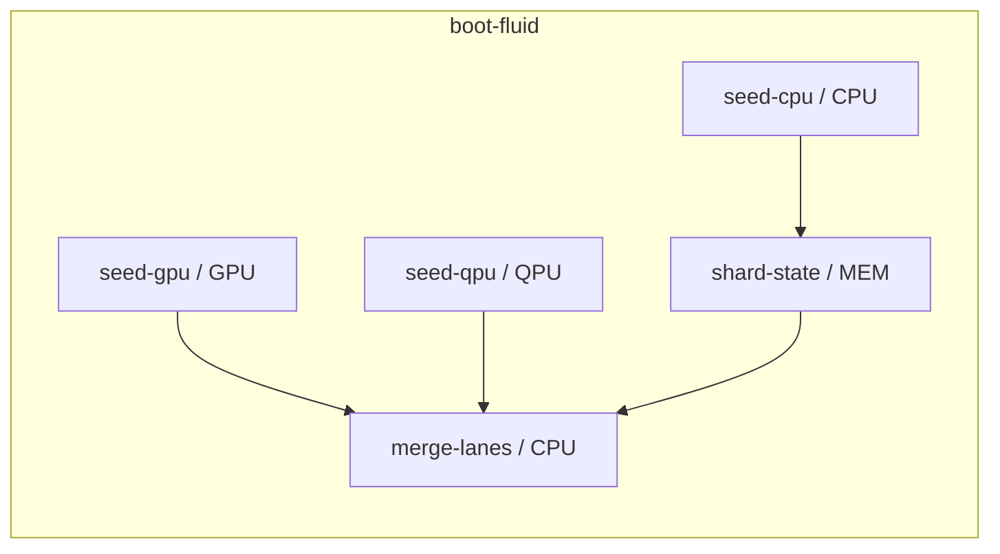

# Hyperclusterup Zitterpolymesh — Workflows, Pipelines, Dependencies

> **Stand:** v10.0.0 · 2026-07-18

Das Zitterpolymesh ist die Workflow-Schicht von AscensionOS/Fusion Hero OS:
ein DAG-Scheduler mit **Parallel-Virtual-Hyperthreading (PVHT)** über vier
Lanes, plus race-sichere Autosave-/Horkrux-Persistenz.

## Die vier Lanes

| Lane | Backend | Echt oder virtuell? |
|------|---------|---------------------|
| CPU  | Thread-Pool, `Kerne × PVHT-Faktor` (env `FUSION_PVHT_FACTOR`, Default 2) | echt |
| MEM  | I/O-Pool für Shards, Autosave, Archiv | echt |
| GPU  | `torch-cuda` wenn Hardware da, sonst CPU-Fallback | echt **nur mit Hardware**, sonst `virtual: true` |
| QPU  | `dwave-neal` (Simulated Annealing) oder Stdlib-SA | **immer `virtual: true`** — es ist kein echter Quantenprozessor angebunden |

Das Reporting lügt nicht: jeder Lauf gibt pro Lane `backend` und `virtual`
aus (`python -m fusion_hero_os.core.zitterpolymesh --probe`).

## Flüssige Workflows (fluid scheduling)

Tasks deklarieren Lane + Dependencies in
[`zitterpolymesh_pipeline.yaml`](zitterpolymesh_pipeline.yaml). Der Scheduler
(`fusion_hero_os/core/zitterpolymesh.py`) startet eine Task, **sobald** ihre
Dependencies erfüllt sind — kein globaler Phasen-Barrier. Unabhängige Tasks
laufen gleichzeitig auf ihren Lanes (nachweisbar per Barrier-Test in
`tests/test_zitterpolymesh.py`).



## Zitterfunktion

Retries nutzen einen **gedämpften, begrenzten Jitter-Backoff**
(`ZitterJitter`): Die Zitteramplitude klingt pro Versuch ab, das Delay ist
durch ein Ceiling begrenzt — das System kehrt zum Fixpunkt zurück, statt
aufzuschwingen. Das ist die operative Form der Poly-Mesh-Zitterfunktion aus
[identity-fixpoint.md](identity-fixpoint.md).

## Raceconditions

Drei Ebenen:

1. **Prozess-/Thread-Ebene:** `fusion_hero_os/core/race_guard.py` —
   FileLock (msvcrt/fcntl), atomare Writes (temp + fsync + `os.replace`),
   Compare-and-Swap mit Generationszähler.
2. **Store-Ebene:** der Horkrux-Store serialisiert Writer über FileLock;
   der Concurrency-Test (6 Writer × 5 Writes) verifiziert, dass kein
   Lost Update auftritt (Generationszähler == Gesamt-Writes).
3. **CI-Ebene:** `concurrency.group` im Workflow — pro Ref läuft höchstens
   ein Mesh-Lauf.

## Multimodale Pseudohorkruxe + Autosave

`fusion_hero_os/core/pseudo_horcrux.py`:

- Ein **Pseudohorkrux** ist ein vollständiger, unabhängig wiederherstellbarer
  Zustandsshard. `preserve()` schreibt denselben Zustand in **drei
  Modalitäten** (JSON, CSV, Base64-Container) × n Kopien, jeweils mit
  SHA-256-Checksumme und Generationszähler.
- `restore()` verifiziert alle Shards und nimmt die höchste gültige
  Generation — **ein** überlebender Shard genügt. Manipulierte Shards
  fallen durch die Checksumme auf und werden ignoriert.
- `AutosaveDaemon` sichert periodisch (Intervall) und ereignisgetrieben
  (`mark_dirty()` mit Debounce) über den Store — race-sicher, weil jeder
  Save durch FileLock + atomare Writes läuft.

## Pipelines und Dependencies

- **Pipeline-Definition:** [`zitterpolymesh_pipeline.yaml`](zitterpolymesh_pipeline.yaml)
  — Workflows `boot-fluid`, `horcrux-cycle`, `qubo-coevolution` mit
  Lane-Zuordnung und `deps`-Kanten. Validierung (Zyklen, unbekannte
  Deps/Ops) per `--validate`.
- **CI-Pipeline:** [`.github/workflows/zitterpolymesh-ci.yml`](.github/workflows/zitterpolymesh-ci.yml)
  bildet den Mesh-DAG in `needs:`-Stufen ab:
  `mesh-validate` → (`lane-smoke`-Matrix über cpu/mem/gpu/qpu ∥
  `race-and-horcrux`) → `fluid-workflows`-Matrix → `mesh-report`.
- **Laufzeit-Dependencies:** nur Stdlib als harte Anforderung; `pyyaml`,
  `torch` (GPU) und `dwave-neal` (QPU-Simulator) werden optional erkannt.

## Schnellstart

```bash
python -m fusion_hero_os.core.zitterpolymesh --probe        # Lane-Profile
python -m fusion_hero_os.core.zitterpolymesh --validate     # DAG prüfen
python -m fusion_hero_os.core.zitterpolymesh --smoke --lane qpu
python -m fusion_hero_os.core.zitterpolymesh --run boot-fluid
python -m pytest tests/test_zitterpolymesh.py tests/test_pseudo_horcrux.py -q
```
